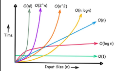

***********************************************BIG O NOTES*******************************************

=====================================================================================================
BIG O Time (Asymptotic Runtime)
=====================================================================================================
Language and time we use to describe the efficieny of algorithms. 

Example: Time it takes to send a file of large capacity to another person in another country. 

Via Plane 
O(1) constant runtime- the time it takes for the file to reach the other person is the same no matter the size of the file. 

Via Electronic Transfer ()
O(n) linear runtime - the time it takes for the file to reach the other person increases and decreases linearly as the size of the file increases or decreases.

NOTE: No matter how big the constant runtime is set to, eventually the linear runtime will surpass the constant runtime. 

O(whp) The time it takes to paint a fence with a width = w, height = h, and number of layers = p

=====================================================================================================
Differences between BIG O, Big Omega, and Big Theta
=====================================================================================================
A way to describe how run time grows as input size n increases. 

Big O (worst-case): Upper bound runtime, the maximum rate at which an algorithm grows, overestimate, ceiling, it won't grow faster that this rate
x < 100

Big Omega (best-case): Lower bound runtime, the minimum rate at which an algorithm grows, underestimate, floor, the least amount of time this algorithm must take
100 < x

Big Theta(exact asymptotic growth): Both upper and lower bounds, the exact rate a function grows, sandwich
1 < x < 100

